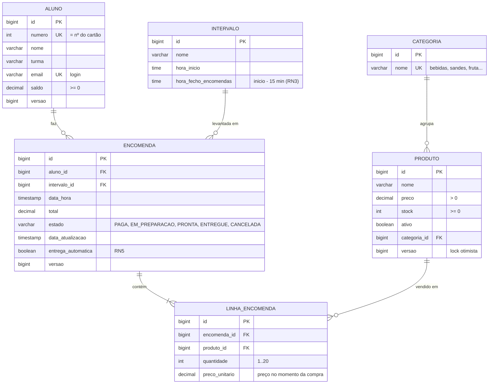

# Diagrama entidade-relação

```mermaid
erDiagram
    CATEGORIA ||--o{ PRODUTO : "agrupa"
    ALUNO ||--o{ ENCOMENDA : "faz"
    INTERVALO ||--o{ ENCOMENDA : "levantada em"
    ENCOMENDA ||--|{ LINHA_ENCOMENDA : "contém"
    PRODUTO ||--o{ LINHA_ENCOMENDA : "vendido em"

    CATEGORIA {
        bigint id PK
        varchar nome UK "bebidas, sandes, fruta..."
    }
    PRODUTO {
        bigint id PK
        varchar nome
        decimal preco "> 0"
        int stock ">= 0"
        boolean ativo
        bigint categoria_id FK
        bigint versao "lock otimista"
    }
    ALUNO {
        bigint id PK
        int numero UK "= nº do cartão"
        varchar nome
        varchar turma
        varchar email UK "login"
        decimal saldo ">= 0"
        bigint versao
    }
    INTERVALO {
        bigint id PK
        varchar nome
        time hora_inicio
        time hora_fecho_encomendas "inicio - 15 min (RN3)"
    }
    ENCOMENDA {
        bigint id PK
        bigint aluno_id FK
        bigint intervalo_id FK
        timestamp data_hora
        decimal total
        varchar estado "PAGA, EM_PREPARACAO, PRONTA, ENTREGUE, CANCELADA"
        timestamp data_atualizacao
        boolean entrega_automatica "RN5"
        bigint versao
    }
    LINHA_ENCOMENDA {
        bigint id PK
        bigint encomenda_id FK
        bigint produto_id FK
        int quantidade "1..20"
        decimal preco_unitario "preço no momento da compra"
    }
```
