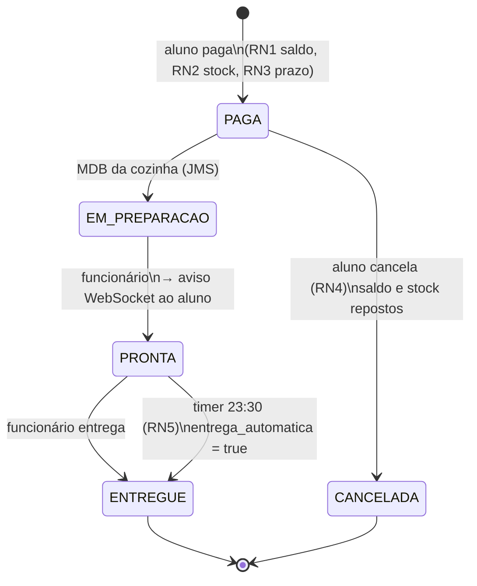

# Diagrama de estados da encomenda

```mermaid
stateDiagram-v2
    [*] --> PAGA : aluno paga\n(RN1 saldo, RN2 stock, RN3 prazo)
    PAGA --> EM_PREPARACAO : MDB da cozinha (JMS)
    PAGA --> CANCELADA : aluno cancela (RN4)\nsaldo e stock repostos
    EM_PREPARACAO --> PRONTA : funcionário\n→ aviso WebSocket ao aluno
    PRONTA --> ENTREGUE : funcionário entrega
    PRONTA --> ENTREGUE : timer 23:30 (RN5)\nentrega_automatica = true
    ENTREGUE --> [*]
    CANCELADA --> [*]
```

As transições permitidas estão codificadas em `EstadoEncomenda.podeMudarPara(...)`
e testadas em `EstadoEncomendaTest`.
